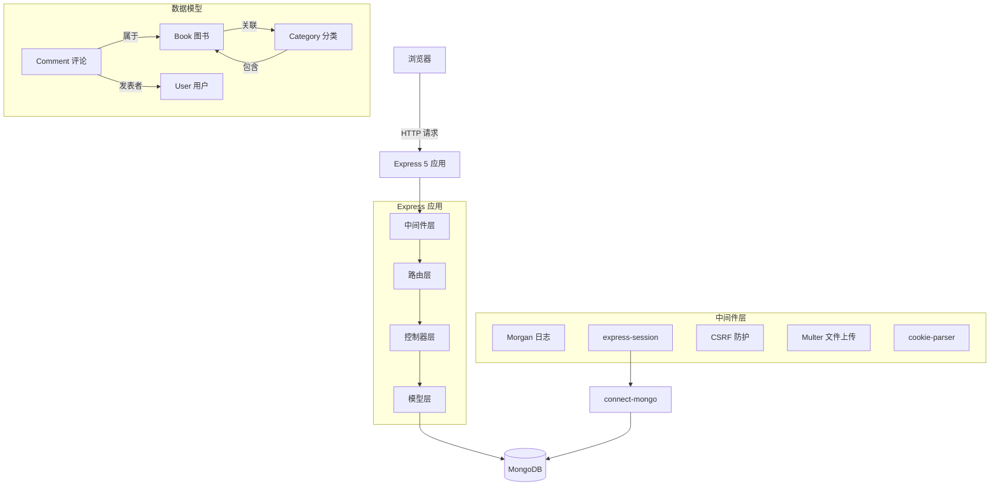
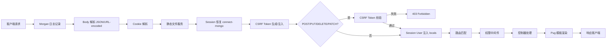
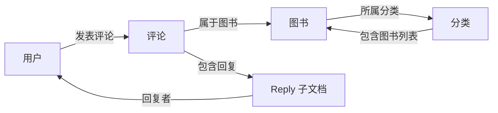

# iBook

基于 Node.js + MongoDB 构建的全栈图书管理网站，提供图书录入、分类管理、用户系统、评论互动等完整功能。

## 架构概览

项目采用经典的 **MVC 分层架构**，基于 Express 5 中间件管道模式组织请求处理流程：

| 层级 | 目录 | 职责 |
|------|------|------|
| **视图层 (View)** | `src/views/` | Pug 模板渲染，基于 layout 布局 + block 继承 |
| **路由层** | `src/routes/` | URL 映射、中间件编排、文件上传配置（按模块拆分） |
| **控制器层 (Controller)** | `src/controllers/` | 业务逻辑、数据库查询、响应渲染、错误传递 |
| **模型层 (Model)** | `src/models/` | Schema 定义 + Model 注册、验证规则、pre-save 钩子、静态方法 |
| **中间件层** | `src/middleware/` | 权限控制等可复用中间件（signinRequired、adminRequired） |
| **工具层 (Utils)** | `src/utils/` | 密码加密、日期格式化等可复用函数 |
| **配置层** | `src/config.mjs` | 集中管理环境变量，按职责分组 |



## 功能概览

### 图书管理

管理员可对图书进行完整的增删改查操作：

- **录入图书**：填写标题、作者、出版社、价格、简介、ISBN、出版年份等信息，同时上传封面图片
- **封面上传**：基于 Multer 中间件实现磁盘存储，封面文件保存到 `public/upload/` 目录，文件名自动添加时间戳避免冲突
- **图书详情**：每次访问详情页自动 +1 PV 浏览量（通过 `findByIdAndUpdate` 原子操作 `$inc`），展示完整的图书信息和评论列表
- **分类关联**：新建图书时可选择已有分类或通过分类名称自动创建新分类，系统自动维护图书与分类之间的双向引用关系
- **编辑与删除**：支持图书信息的修改和删除，删除操作通过 Ajax 异步完成并实时移除页面行
- **列表管理**：后台图书列表页按更新时间倒序展示所有图书，提供快速编辑和删除入口

### 分类管理

对图书分类进行系统化管理：

- **分类 CRUD**：创建新分类、编辑分类名称、删除分类
- **分类详情**：展示该分类下所有关联图书（封面 + 标题），支持分页浏览
- **分类与图书关联**：每个分类维护一个图书 ObjectId 数组，通过 `populate` 查询时自动填充图书信息
- **首页分类展示**：首页按分类分组展示图书，每个分类最多显示 6 本，方便用户按类别浏览
- **列表管理**：后台分类列表页按更新时间倒序展示所有分类

### 用户系统

完整的用户认证与权限管理体系：

- **注册**：支持独立注册页面和 Modal 弹窗快速注册两种方式，注册时自动检查用户名唯一性，重复用户名跳转至登录页
- **登录**：支持独立登录页面和 Modal 弹窗快捷登录，验证密码成功后将用户信息写入 Session，同时支持 Modal 弹窗中的隐藏字段传递 CSRF Token
- **登出**：清除 Session 中的用户信息，重定向至首页
- **密码安全**：
  - 存储：使用 `crypto.scrypt` 加盐哈希，16 字节随机盐 + 64 字节密钥，格式为 `salt_hex:hash_hex`
  - 比对：`timingSafeEqual` 恒定时间比较，防止时序攻击
  - 自动加密：Schema 的 `pre-save` 钩子检测密码变更，自动执行哈希处理
- **权限控制**：基于 role 数值的两级角色模型
  - 普通用户（role: 0）— 可浏览图书、搜索、发表评论和回复
  - 管理员（role ≥ 10）— 额外拥有图书、分类、用户的后台管理权限
- **管理员脚本**：`scripts/createAdmin.mjs` 支持自定义用户名、密码和角色值，用户已存在时自动提升角色
- **Session 持久化**：通过 connect-mongo 将 Session 存储到 MongoDB，服务重启后用户登录状态不丢失
- **用户管理后台**：管理员可查看所有用户列表、查看用户详情、修改用户信息（名称/密码/角色）、删除用户

### 评论系统

围绕图书的社区互动功能：

- **发表评论**：登录用户可在图书详情页发表文字评论
- **回复评论**：支持对已有评论进行回复，点击回复按钮时前端脚本动态注入 `comment[cid]`（评论 ID）和 `comment[tid]`（被回复用户 ID）隐藏字段
- **嵌套回复**：评论 Schema 中内嵌 `reply` 数组，每条回复记录 `from`（回复者）、`to`（被回复者）、`content`（回复内容）
- **关联展示**：通过 Mongoose `populate` 自动填充评论者和回复者的用户名，在详情页完整展示评论及回复链
- **CSRF 保护**：评论提交需通过跨站防护校验，防止恶意伪造评论请求

### 搜索与分页

图书检索与结果浏览：

- **关键词搜索**：通过 URL 参数 `?q=关键词` 触发，使用正则表达式（`new RegExp(q + '.*', 'i')`）对标题进行大小写不敏感的模糊匹配
- **分类筛选**：通过 URL 参数 `?cat=分类ID` 触发，查询指定分类下的所有关联图书
- **分页导航**：每页显示 2 条结果，支持页码跳转，URL 参数 `?p=页码` 控制当前页，页面展示总页数和当前页码
- **搜索栏**：页面顶部导航栏集成搜索输入框，GET 方式提交搜索关键词

### 安全防护

多层安全机制保障应用安全：

- **CSRF 防护**：
  - 生成：首次请求时生成 32 字节随机 Token 存入 Session，注入 `res.locals.csrfToken` 供模板使用
  - 传递：表单通过隐藏字段 `_csrf` 传递，Ajax 请求通过 `X-CSRF-Token` Header 传递
  - 校验：中间件拦截所有 POST/PUT/DELETE/PATCH 请求，校验失败返回 403
- **密码安全**：`crypto.scrypt` + 随机盐 + `timingSafeEqual`，零外部依赖
- **生产环境保护**：`SESSION_SECRET` 未配置时应用启动直接报错退出，防止使用默认密钥上线
- **差异化错误处理**：开发环境返回完整错误堆栈便于调试，生产环境仅返回错误消息隐藏内部实现

## 技术栈

| 层级     | 技术                                     |
|---------|----------------------------------------|
| 运行时    | Node.js ≥ 20.11.0                     |
| 服务端框架 | Express 5                              |
| 数据库    | MongoDB + Mongoose 9                   |
| 模板引擎  | Pug                                    |
| 前端     | Bootstrap 5.3.3 + 原生 JavaScript        |
| 文件上传  | Multer（磁盘存储）                         |
| 会话管理  | express-session + connect-mongo         |
| 密码加密  | Node.js crypto 模块（scrypt 算法）        |
| 请求日志  | Morgan                                 |
| 代码规范  | ESLint 10（flat config，@eslint/js recommended） |
| 测试     | Node.js 内置 test runner + supertest    |
| 包管理   | pnpm                                   |
| 配置管理  | dotenv + 集中式 config.mjs              |

## 技术亮点

### 全栈 ESM + async/await 现代化架构

项目完全采用 ES Module 规范（`"type": "module"`），所有异步操作均使用 `async/await` + `try/catch` 处理，消除了回调地狱，代码可读性和可维护性显著提升。控制器层统一通过 `next(err)` 将错误传递到集中式错误处理中间件。

### 零外部依赖的密码安全方案

未使用 `bcrypt` 等第三方加密库，而是基于 Node.js 内置 `crypto` 模块实现了完整的密码安全体系：
- **`crypto.scrypt`**：采用 scrypt 密钥派生函数，抗 GPU/ASIC 暴力破解
- **随机盐**：每次加密生成独立的 16 字节随机盐，防止彩虹表攻击
- **`timingSafeEqual`**：恒定时间比较，杜绝时序侧信道攻击
- **存储格式**：`salt_hex:hash_hex`，验证时自动解析盐值

这种方案无需引入额外依赖，减少了攻击面和供应链风险。

### 三层 CSRF 防护链

CSRF 防护通过中间件链实现，逻辑清晰且与业务解耦：
1. **Token 生成**：首次请求时生成 32 字节随机 Token 并存入 Session
2. **Token 注入**：将 Token 注入到 `res.locals`，Pug 模板自动渲染为表单隐藏字段
3. **Token 校验**：拦截所有写入请求（POST/PUT/DELETE/PATCH），校验 `_csrf` 字段或 `X-CSRF-Token` Header

### Mongoose Schema + Model 一体化设计

每个模型文件同时包含 Schema 定义和 Model 注册：
- **Schema 部分**：定义字段结构、验证规则、`pre-save` 钩子（时间戳自动维护、密码自动加密）、静态方法和实例方法
- **Model 注册**：文件末尾通过 `mongoose.model()` 完成注册并导出

这种一体化方式减少了文件数量，Schema 定义与 Model 注册紧密关联，便于快速定位和理解模型全貌。

### 模块化路由与中间件驱动的权限控制

路由按业务模块拆分为独立文件（`home.mjs`、`user.mjs`、`book.mjs`、`comment.mjs`、`category.mjs`），通过 `src/routes/index.mjs` 统一聚合。权限检查通过 `src/middleware/auth.mjs` 提供的可组合中间件函数实现：

```javascript
// src/routes/book.mjs
import { signinRequired, adminRequired } from '../middleware/auth.mjs'

// 单中间件：仅要求登录
router.get('/admin/user/list', signinRequired, adminRequired, User.list)

// 多中间件链：登录 → 管理员 → 文件上传 → 封面处理 → 保存
router.post('/admin/book', signinRequired, adminRequired, upload.any(), Book.saveCover, Book.save)
```

`signinRequired` 检查 Session 中是否存在用户，`adminRequired` 进一步检查 `role ≥ 10`，中间件可自由组合，灵活适配不同路由的权限需求。

### 差异化错误处理策略

根据运行环境提供不同的错误响应：
- **开发环境**：返回完整错误堆栈，便于调试定位
- **生产环境**：仅返回错误消息，隐藏内部实现细节，防止信息泄露

### 测试基础设施隔离

- 测试数据库 `iBook_test` 与开发/生产完全隔离，自动去重连接
- 测试应用工厂 `createApp({ enableCsrf })` 支持按需开关 CSRF，既保证测试覆盖率又简化测试编写
- 单元测试与集成测试分目录组织，`node --test` 统一运行

### 集中式配置体系

通过 `src/config.mjs` 集中管理所有配置项，结合 `dotenv` 从 `.env` 文件加载：
- 每个配置项都有合理的开发默认值
- 生产环境关键配置（如 `SESSION_SECRET`）缺失时立即报错，避免带病上线
- 配置项按职责分组（数据库、会话、日志、上传），结构清晰

## 快速开始

### 环境要求

- **Node.js** ≥ 20.11.0
- **MongoDB** 已安装并运行
- **pnpm** 包管理器（`npm install -g pnpm`）

### 安装步骤

```bash
# 1. 克隆项目
git clone <repo-url>
cd iBook

# 2. 安装依赖
pnpm install

# 3. 配置环境变量
cp .env.example .env

# 4. 启动 MongoDB（如尚未运行）
mongod

# 5. 创建管理员账号（可选）
node scripts/createAdmin.mjs

# 6. 启动服务
pnpm start
```

服务默认运行在 **http://localhost:3000**。

### 验证安装

安装完成后可通过以下步骤确认各组件正常工作：

1. **数据库连接**：启动后终端应输出「数据库连接成功」，如显示「数据库连接失败」请检查 MongoDB 是否运行
2. **首页访问**：浏览器打开 `http://localhost:3000`，应看到带有导航栏和搜索框的首页
3. **管理员功能**：运行 `node scripts/createAdmin.mjs` 后登录，底部导航栏应出现图书管理、分类管理、用户管理等快捷入口
4. **运行测试**：执行 `pnpm test`，所有测试用例应全部通过

### 常见问题

| 问题 | 原因 | 解决方案 |
|------|------|--------|
| 启动报错 `EADDRINUSE` | 端口 3000 已被占用 | 修改 `.env` 中的 `PORT` 或终止占用进程 |
| 数据库连接失败 | MongoDB 未启动或地址错误 | 确认 `mongod` 已运行，检查 `MONGO_URL` |
| 生产环境启动报错 | 未配置 `SESSION_SECRET` | 在 `.env` 中设置 `SESSION_SECRET` |
| 封面上传失败 | `public/upload/` 无写入权限 | 执行 `chmod 755 public/upload` |
| 测试失败 | 测试数据库连接问题 | 确认 MongoDB 运行中，测试会自动使用 `iBook_test` 库 |

## 环境变量

项目采用集中式配置体系，`src/config.mjs` 在入口自动加载 `dotenv/config`，所有配置项通过 `process.env` 读取。复制 `.env.example` 为 `.env` 并根据需要修改：

| 变量                        | 说明                          | 默认值                                     |
|---------------------------|----------------------------|-------------------------------------|
| `NODE_ENV`                | 运行环境（影响错误信息展示策略）       | `development`                       |
| `PORT`                    | 服务端口（`www.mjs` 启动时读取）    | `3000`                              |
| `MONGO_URL`               | MongoDB 连接地址（应用和 Session 共用） | `mongodb://127.0.0.1:27017/iBook`   |
| `SESSION_SECRET`          | Session 密钥（生产环境**必须**修改，否则启动报错） | `iBook-dev-secret-change-in-production` |
| `SESSION_RESAVE`          | Session 是否强制保存（`'false'` 字符串关闭） | `true`                              |
| `SESSION_SAVE_UNINITIALIZED` | 是否保存未初始化的 Session（`'false'` 字符串关闭） | `true`                              |
| `MORGAN_FORMAT`           | 日志格式（dev/combined/common/short/tiny） | `dev`                     |

> **配置分组设计**：`src/config.mjs` 将配置项按职责分为 `db`（数据库）、`session`（会话）、`morgan`（日志）、`upload`（上传）四组，各层代码通过 `import config from './config.mjs'` 统一访问，避免分散读取 `process.env`。

管理员脚本（`scripts/createAdmin.mjs`）额外支持：

| 变量             | 说明              | 默认值        |
|----------------|----------------|------------|
| `ADMIN_NAME`   | 管理员用户名       | `admin`    |
| `ADMIN_PASSWORD` | 管理员密码       | `admin123` |
| `ADMIN_ROLE`   | 管理员角色值       | `10`       |

## 项目结构

```
iBook/
├── src/
│   ├── controllers/        # 路由控制器（业务逻辑层）
│   │   ├── index.mjs       #   首页与搜索
│   │   ├── user.mjs        #   用户注册/登录/管理
│   │   ├── book.mjs        #   图书 CRUD + 封面处理
│   │   ├── comment.mjs     #   评论与回复
│   │   └── category.mjs    #   分类管理
│   ├── middleware/          # 中间件
│   │   └── auth.mjs        #   权限控制（signinRequired、adminRequired）
│   ├── models/             # Mongoose Schema 定义 + Model 注册
│   │   ├── book.mjs        #   图书（含静态方法 fetch、pre-save 时间戳）
│   │   ├── user.mjs        #   用户（含密码加密、比对方法、pre-save 钩子）
│   │   ├── comment.mjs     #   评论（含回复数组、pre-save 时间戳）
│   │   └── category.mjs    #   分类（关联图书数组、pre-save 时间戳）
│   ├── routes/             # 路由定义（按模块拆分）
│   │   ├── index.mjs       #   路由聚合入口
│   │   ├── home.mjs        #   首页、搜索结果
│   │   ├── user.mjs        #   用户注册/登录/管理
│   │   ├── book.mjs        #   图书 CRUD（含 Multer 磁盘存储配置）
│   │   ├── comment.mjs     #   评论发表
│   │   └── category.mjs    #   分类管理
│   ├── utils/              # 工具函数
│   │   ├── password.mjs    #   密码哈希与比对（scrypt + timingSafeEqual）
│   │   └── date.mjs        #   日期格式化（MM/DD/YYYY）
│   ├── views/              # Pug 模板
│   │   ├── includes/       #   公共片段
│   │   │   ├── head.pug    #     <head> 资源引入（Bootstrap 5.3.3 CDN）
│   │   │   ├── header.pug  #     顶部导航栏、搜索框、登录注册弹窗
│   │   │   └── footer.pug  #     底部导航栏（管理员快捷入口）
│   │   ├── pages/          #   页面模板（首页、详情、列表、管理等）
│   │   └── layout.pug      #   布局模板
│   ├── app.mjs             # Express 应用配置（中间件注册、错误处理）
│   └── config.mjs          # 集中式配置（读取 .env 环境变量）
├── bin/
│   └── www.mjs             # HTTP 服务启动入口（端口监听、错误处理）
├── public/                 # 静态资源
│   ├── js/                 #   前端脚本（原生 JavaScript，无 jQuery 依赖）
│   │   ├── admin.js        #     后台删除操作（fetch DELETE + CSRF Header）
│   │   └── detail.js       #     评论回复交互（动态注入隐藏字段）
│   └── upload/             #   上传文件存储目录
├── scripts/
│   └── createAdmin.mjs     # 管理员账号创建/提权脚本
├── tests/                  # 测试用例
│   ├── helpers/            #   测试辅助
│   │   ├── app.mjs         #     Express 测试应用工厂（可选 CSRF）
│   │   └── db.mjs          #     测试数据库连接管理（独立 iBook_test 库）
│   ├── integration/        #   集成测试（supertest HTTP 请求模拟）
│   │   ├── book.test.mjs
│   │   ├── category.test.mjs
│   │   ├── comment.test.mjs
│   │   ├── index.test.mjs
│   │   └── user.test.mjs
│   └── unit/utils/         #   单元测试（工具函数）
│       ├── date.test.mjs
│       └── password.test.mjs
├── .env.example            # 环境变量示例
├── eslint.config.mjs       # ESLint flat config
└── package.json
```

## 请求处理流程

每个请求经过以下中间件管道（按注册顺序）：



**各步骤说明**：

| 步骤 | 中间件 | 作用 |
|------|--------|------|
| 1 | `morgan` | 记录请求方法、URL、状态码、响应时间 |
| 2 | `express.json` / `express.urlencoded` | 解析请求体，支持 JSON 和表单数据 |
| 3 | `cookie-parser` | 解析 Cookie 头，为 Session 提供支持 |
| 4 | `express.static` | 服务 `public/` 目录下的静态文件（JS、CSS、上传图片） |
| 5 | `express-session` | 从 MongoDB 恢复 Session，注入 `req.session` |
| 6 | CSRF 生成 | 生成随机 Token 存入 Session，注入 `res.locals.csrfToken` |
| 7 | CSRF 校验 | 写入请求校验 Token，失败返回 403；GET 请求跳过 |
| 8 | User 注入 | 将 `req.session.user` 注入 `res.locals.user`，模板可直接访问 |
| 9 | 路由匹配 | 匹配 URL 并执行路由定义的中间件链 |
| 10 | 权限中间件 | `signinRequired` → `adminRequired`，检查登录状态和角色 |
| 11 | 控制器 | async 业务逻辑，通过 `next(err)` 传递错误 |
| 12 | 404 捕获 | 未匹配路由的请求返回 404 |
| 13 | 错误处理 | 根据环境返回完整堆栈（开发）或仅消息（生产） |

## 数据模型

所有模型共享统一的时间戳机制：每个 Schema 的 `pre-save` 钩子自动维护 `meta.createdAt` 和 `meta.updateAt`，新建时两者相同，更新时仅刷新 `updateAt`。所有模型均提供 `fetch()` 静态方法，按 `updateAt` 降序返回全部记录。

### Book（图书）
| 字段        | 类型     | 必填 | 说明       |
|-----------|--------|------|----------|
| title     | String | 是   | 书名       |
| author    | String | 是   | 作者       |
| publisher | String | 否   | 出版社      |
| price     | String | 是   | 价格       |
| summary   | String | 是   | 简介       |
| isbn      | String | 否   | ISBN      |
| cover     | String | 否   | 封面文件名   |
| year      | String | 否   | 出版年份    |
| category  | ObjectId → Category | 否 | 所属分类 |
| pv        | Number | 否   | 浏览量（默认 0，每次访问详情页 +1） |
| meta.createdAt | Date | 自动 | 创建时间 |
| meta.updateAt  | Date | 自动 | 更新时间 |

**静态方法**：`fetch()` — 按 `updateAt` 降序返回所有图书。

### User（用户）
| 字段       | 类型     | 必填 | 说明                     |
|----------|--------|------|--------------------------|
| name     | String | 是   | 用户名（唯一索引）          |
| password | String | 是   | 密码（pre-save 自动 scrypt 哈希） |
| role     | Number | 否   | 角色（0=普通用户，≥10=管理员，默认 0） |
| meta.createdAt | Date | 自动 | 创建时间 |
| meta.updateAt  | Date | 自动 | 更新时间 |

**实例方法**：`comparePassword(password)` — 比对明文密码与存储哈希。
**静态方法**：`fetch()` — 按 `updateAt` 降序返回所有用户。

### Comment（评论）
| 字段      | 类型     | 必填 | 说明           |
|---------|--------|------|----------------|
| book    | ObjectId → Book | 是 | 关联图书（已建索引） |
| from    | ObjectId → User | 是 | 评论者         |
| reply   | Array  | 否   | 回复列表         |
| reply[].from | ObjectId → User | 否 | 回复者 |
| reply[].to   | ObjectId → User | 否 | 被回复者 |
| reply[].content | String | 否 | 回复内容 |
| meta.createdAt | Date | 自动 | 创建时间 |
| meta.updateAt  | Date | 自动 | 更新时间 |

**静态方法**：`fetch()` — 按 `updateAt` 降序返回所有评论。

### Category（分类）
| 字段    | 类型     | 必填 | 说明          |
|-------|--------|------|----------------|
| name  | String | 是   | 分类名称        |
| books | Array[ObjectId → Book] | 否 | 关联图书列表 |
| meta.createdAt | Date | 自动 | 创建时间 |
| meta.updateAt  | Date | 自动 | 更新时间 |

**静态方法**：`fetch()` — 按 `updateAt` 降序返回所有分类。

### 模型关系图



## 路由一览

> 路由定义中串联的中间件链展示了每个请求实际经过的处理步骤。

### 公开路由
| 方法   | 路径             | 说明         |
|------|----------------|--------------|
| GET  | `/`            | 首页（按分类分组展示图书，每分类最多 6 本） |
| GET  | `/book/:id`    | 图书详情页（含评论列表、PV 自增）  |
| GET  | `/signup`      | 注册页面       |
| GET  | `/signin`      | 登录页面       |
| POST | `/user/signup` | 提交注册（重复用户名跳转登录页）      |
| POST | `/user/signin` | 提交登录（验证密码，成功后写入 Session） |
| GET  | `/logout`      | 退出登录（清除 Session）      |
| GET  | `/results`     | 搜索结果页（支持 `?q=关键词` 模糊搜索和 `?cat=分类ID` 筛选，分页） |

### 管理员路由（需登录且 role ≥ 10）
| 方法     | 路径                        | 中间件链                         | 说明         |
|--------|----------------------------|------------------------------|--------------|
| GET    | `/admin/book/list`         | signinRequired → adminRequired | 图书列表       |
| GET    | `/admin/book/new`          | signinRequired → adminRequired | 新建图书页面    |
| GET    | `/admin/book/update/:id`   | signinRequired → adminRequired | 编辑图书页面    |
| POST   | `/admin/book`              | signinRequired → adminRequired → upload.any → saveCover | 保存图书（新建/更新，含封面上传） |
| DELETE | `/admin/book/list?id=xxx`  | signinRequired → adminRequired | 删除图书（Ajax 响应 JSON） |
| GET    | `/admin/category/new`      | signinRequired → adminRequired | 新建分类页面    |
| GET    | `/admin/category/list`     | signinRequired → adminRequired | 分类列表       |
| GET    | `/admin/category/:id`      | signinRequired → adminRequired | 分类详情（展示关联图书，分页）   |
| GET    | `/admin/category/update/:id` | signinRequired → adminRequired | 编辑分类页面  |
| POST   | `/admin/category`          | signinRequired → adminRequired | 保存新分类      |
| POST   | `/admin/category/update/:id` | signinRequired → adminRequired | 更新分类名称   |
| DELETE | `/admin/category/list?id=xxx` | signinRequired → adminRequired | 删除分类（Ajax 响应 JSON） |
| GET    | `/admin/user/list`         | signinRequired → adminRequired | 用户列表       |
| GET    | `/admin/user/:id`          | signinRequired → adminRequired | 用户详情       |
| GET    | `/admin/user/update/:id`   | signinRequired → adminRequired | 编辑用户页面    |
| POST   | `/admin/user/update/:id`   | signinRequired → adminRequired | 更新用户（名称/密码/角色）|
| DELETE | `/admin/user/list?id=xxx`  | signinRequired → adminRequired | 删除用户（Ajax 响应 JSON） |

### 需登录路由
| 方法   | 路径              | 说明         |
|------|-----------------|--------------|
| POST | `/user/comment` | 发表评论或回复（含 CSRF 校验）  |

## 前端交互

### 模板体系

项目使用 **Pug 模板引擎**，采用布局 + 页面继承模式：

```
layout.pug（布局模板）
├── includes/head.pug    → <head> 部分：CSS/JS 资源引入（Bootstrap 5.3.3 CDN）
├── includes/header.pug  → 页面头部：导航栏、搜索框、登录注册弹窗
├── block hero           → 可选的 hero 区域
├── block content        → 各页面通过 block 填充主体内容
└── includes/footer.pug  → 页面底部：版权信息、管理员快捷入口
```

- **布局模板**（`layout.pug`）：定义 HTML 基本骨架，统一引入 head、header、footer 公共片段
- **顶部导航栏**（`header.pug`）：展示站点标语、首页/书籍导航链接、全局搜索框、登录/注册入口（Bootstrap Modal 弹窗），根据用户登录状态动态渲染
- **底部导航栏**（`footer.pug`）：展示版权信息、首页/书籍链接，当用户 `role ≥ 10` 时显示图书管理、分类管理、用户管理快捷入口
- **登录注册弹窗**：未登录用户可通过 Bootstrap Modal 弹窗快捷登录/注册，弹窗表单自动携带 CSRF Token 隐藏字段
- **模板全局变量**：`formatDate` 工具函数注册为 `app.locals`，模板中可直接调用格式化日期；`user` 和 `csrfToken` 通过中间件注入 `res.locals`

### 前端脚本

| 文件           | 功能                                    |
|--------------|----------------------------------------|
| `admin.js`   | 后台管理页面删除操作：基于 `fetch` API 发送 DELETE 请求 + `X-CSRF-Token` Header（从 `<meta>` 标签读取 CSRF Token），成功后移除对应 DOM 行。支持图书、分类、用户的统一删除逻辑（通过 `data-url` 属性区分） |
| `detail.js`  | 图书详情页评论回复：点击回复按钮时动态注入 `comment[tid]`（被回复用户 ID）和 `comment[cid]`（评论 ID）隐藏字段，支持对任意层级评论的回复 |

### 页面列表

| 模板文件              | 对应页面        | 访问权限 |
|---------------------|--------------|--------|
| `index.pug`         | 首页（按分类分组展示图书） | 公开     |
| `detail.pug`        | 图书详情 + 评论  | 公开     |
| `results.pug`       | 搜索结果（分页）   | 公开     |
| `signin.pug`        | 登录页面        | 公开     |
| `signup.pug`        | 注册页面        | 公开     |
| `error.pug`         | 错误页面（404/500） | 公开     |
| `bookList.pug`      | 图书管理列表     | 管理员    |
| `addBook.pug`       | 图书录入/编辑（复用同一模板） | 管理员    |
| `categorylist.pug`  | 分类管理列表     | 管理员    |
| `category_admin.pug`| 分类录入        | 管理员    |
| `category_update.pug`| 分类编辑       | 管理员    |
| `userlist.pug`      | 用户管理列表     | 管理员    |
| `userDetail.pug`    | 用户详情        | 管理员    |
| `userUpdate.pug`    | 用户编辑        | 管理员    |

## 测试

项目使用 Node.js 内置 `node:test` 模块 + supertest 进行测试，无需额外安装测试框架。

```bash
# 运行全部测试（单元测试 + 集成测试，顺序执行避免端口冲突）
pnpm test

# 监听模式（开发时文件变更自动重跑）
pnpm test:watch
```

### 测试结构

| 类型     | 文件                   | 覆盖内容                          |
|--------|----------------------|----------------------------------|
| 单元测试  | `date.test.mjs`      | 日期格式化工具函数（正常格式、无效输入、自定义格式） |
| 单元测试  | `password.test.mjs`  | 密码哈希生成、明文比对、错误密码拒绝、盐值唯一性     |
| 集成测试  | `index.test.mjs`     | 首页加载、关键词搜索、分类筛选              |
| 集成测试  | `user.test.mjs`      | 注册、登录、登出、重复用户名、用户管理 CRUD    |
| 集成测试  | `book.test.mjs`      | 图书 CRUD、封面上传、PV 自增          |
| 集成测试  | `category.test.mjs`  | 分类 CRUD、分类图书关联                 |
| 集成测试  | `comment.test.mjs`   | 评论发表、评论回复                     |

### 测试基础设施

测试使用独立的 `iBook_test` 数据库，与开发/生产数据完全隔离：

- **`createApp({ enableCsrf })`** — 创建可配置的测试用 Express 应用（默认关闭 CSRF 以简化测试，可通过参数开启测试 CSRF 校验逻辑）
- **`connectDB()`** — 连接测试数据库（自动去重，多次调用只连接一次）
- **`clearDB()`** — 遍历所有集合并清空数据，用于每个测试用例前的数据重置
- **`disconnectDB()`** — 断开数据库连接

### 编写测试指南

新增功能时建议同步编写测试，遵循现有模式：

```javascript
import { describe, it, before, after, beforeEach } from 'node:test'
import assert from 'node:assert/strict'
import { createApp } from '../helpers/app.mjs'
import { connectDB, disconnectDB, clearDB } from '../helpers/db.mjs'
import request from 'supertest'

describe('功能名称', () => {
  let app

  before(async () => {
    await connectDB()
    app = createApp()
  })

  beforeEach(async () => {
    await clearDB()  // 每个用例前清空数据
  })

  after(async () => {
    await disconnectDB()
  })

  it('应完成某项操作', async () => {
    const res = await request(app).get('/some-path')
    assert.equal(res.status, 200)
  })
})
```

## 开发指南

### 代码规范

项目使用 ESLint 10 flat config，基于 `@eslint/js` recommended 规则：

```bash
# 代码检查
npx eslint .

# 自动修复
npx eslint . --fix
```

**配置要点**：
- 全局启用 ESM 模块（`sourceType: 'module'`）
- Node.js 全局变量（`globals.node`）
- `no-unused-vars` 忽略 `next` 和 `_` 开头的参数（适配 Express 中间件签名）
- `public/` 目录前端脚本单独配置浏览器环境（`sourceType: 'script'`，`globals.browser`）

### 调试模式

启用 Express 框架层面的详细日志输出：

```bash
DEBUG=iBook:* pnpm start
```

如需同时查看 HTTP 请求日志，可调整 Morgan 格式：

```bash
# .env
MORGAN_FORMAT=combined
```

### 密码加密机制

密码采用 `crypto.scrypt` 方案，流程如下：

```
注册/修改密码:
  明文密码 + 随机16字节盐 → scrypt 派生64字节密钥 → 存储 "salt_hex:hash_hex"

登录验证:
  明文密码 + 提取存储的盐 → scrypt 派生64字节密钥 → timingSafeEqual 比对
```

**关键点**：
- 盐值和密码哈希以十六进制拼接存储，验证时拆分提取
- `timingSafeEqual` 要求比较的两个 Buffer 长度相同，长度不一致时直接返回 `false`
- `pre-save` 钩子仅在 `isModified('password')` 时触发加密，避免修改其他字段时重复哈希

### 新增图书时分类处理

保存新图书时，分类字段支持两种模式：
1. **选择已有分类**：通过 `category`（ObjectId）关联，将图书 ID push 到分类的 `books` 数组
2. **创建新分类**：通过 `categoryName` 字段，先创建分类并关联图书 ID，再将分类 ID 回写到图书

编辑已有图书时，直接合并更新字段，不涉及分类关系的变更。

### 添加新功能的标准流程

遵循项目现有的 MVC 分层模式：

1. **定义数据结构**：在 `src/models/` 中新建模型文件，定义 Schema（含字段、`pre-save` 钩子和静态方法）并通过 `mongoose.model()` 注册
2. **编写控制器**：在 `src/controllers/` 中导出 async 函数，包含业务逻辑和错误处理
3. **定义路由**：在 `src/routes/` 对应模块文件中注册路由，按需串联 `src/middleware/auth.mjs` 中的权限中间件
4. **创建模板**：在 `src/views/pages/` 中添加 Pug 模板，继承 `layout.pug`
5. **编写测试**：在 `tests/` 对应目录中添加测试用例
6. **代码检查**：运行 `npx eslint .` 确保代码规范

## 部署

### 生产环境配置

1. 设置 `NODE_ENV=production`
2. **必须**设置强随机 `SESSION_SECRET`
3. 配置生产环境 `MONGO_URL`
4. 建议使用 `combined` 日志格式：`MORGAN_FORMAT=combined`

```bash
NODE_ENV=production \
MONGO_URL=mongodb://db-host:27017/iBook \
SESSION_SECRET=<strong-random-string> \
MORGAN_FORMAT=combined \
pnpm start
```

### 管理员初始化

首次部署后运行管理员创建脚本：

```bash
ADMIN_NAME=admin ADMIN_PASSWORD=<strong-password> node scripts/createAdmin.mjs
```

如果用户已存在但角色不够，脚本会自动提升角色。

### 进程管理

生产环境建议使用进程管理器确保服务持久运行：

**PM2 方式**：

```bash
npm install -g pm2
pm2 start bin/www.mjs --name iBook --node-args="--env-file=.env"
pm2 save
pm2 startup
```

**systemd 方式**（创建 `/etc/systemd/system/ibook.service`）：

```ini
[Unit]
Description=iBook Application
After=network.target mongod.service

[Service]
Type=simple
User=www-data
WorkingDirectory=/path/to/iBook
EnvironmentFile=/path/to/iBook/.env
ExecStart=/usr/bin/node bin/www.mjs
Restart=on-failure
RestartSec=5

[Install]
WantedBy=multi-user.target
```

### Nginx 反向代理参考

```nginx
server {
    listen 80;
    server_name your-domain.com;
    return 301 https://$server_name$request_uri;
}

server {
    listen 443 ssl http2;
    server_name your-domain.com;

    ssl_certificate     /path/to/cert.pem;
    ssl_certificate_key /path/to/key.pem;

    client_max_body_size 10M;  # 允许封面图片上传

    location / {
        proxy_pass http://127.0.0.1:3000;
        proxy_set_header Host $host;
        proxy_set_header X-Real-IP $remote_addr;
        proxy_set_header X-Forwarded-For $proxy_add_x_forwarded_for;
        proxy_set_header X-Forwarded-Proto $scheme;
    }

    location /upload/ {
        alias /path/to/iBook/public/upload/;
        expires 30d;
    }
}
```

## 使用建议

### 首次体验推荐流程

```bash
# 1. 启动项目
pnpm start

# 2. 创建管理员（另开终端）
node scripts/createAdmin.mjs
```

1. 访问 `http://localhost:3000`，点击右上角「登录」，使用默认管理员账号 `admin` / `admin123` 登录
2. 登录后底部导航栏出现图书管理、分类管理、用户管理等快捷入口，依次体验：
   - **添加分类**：先创建几个图书分类（如「文学」「科技」「历史」）
   - **添加图书**：录入图书信息并上传封面，可选择已有分类或填写新分类名
   - **浏览首页**：返回首页查看按分类分组展示的图书
3. 退出管理员账号，注册一个普通用户，体验：
   - 进入图书详情页，发表评论
   - 对其他评论进行回复
   - 使用顶部搜索框搜索图书

### 日常开发建议

- **修改配置**：统一编辑 `.env` 文件，无需改动代码。开发环境可使用默认值，无需创建 `.env` 文件
- **调试问题**：遇到疑难问题时使用 `DEBUG=iBook:* pnpm start` 启动，查看 Express 框架层面的详细日志
- **新增页面**：遵循现有模式 —— 先在 `src/routes/` 对应模块文件定义路由，再在 `src/controllers/` 编写业务逻辑，最后在 `src/views/pages/` 添加 Pug 模板
- **新增数据模型**：在 `src/models/` 新建模型文件，包含 Schema 定义（含 `pre-save` 钩子和静态方法）和 Model 注册，保持分层一致
- **编写测试**：新增功能后同步编写测试，集成测试使用 `createApp()` 工厂创建应用，避免污染开发数据库

### 生产部署清单

- [ ] 设置 `NODE_ENV=production`
- [ ] 生成并配置强随机 `SESSION_SECRET`（建议 `openssl rand -hex 32`）
- [ ] 配置生产环境 MongoDB 连接地址（建议使用副本集或 MongoDB Atlas）
- [ ] 日志格式改为 `combined`：`MORGAN_FORMAT=combined`
- [ ] 创建管理员账号并修改默认密码
- [ ] 确保 `public/upload/` 目录有写入权限
- [ ] 配置反向代理（Nginx）并启用 HTTPS
- [ ] 使用 PM2 或 systemd 管理进程，确保崩溃自动重启

### 扩展建议

- **文件上传**：当前使用本地磁盘存储，生产环境建议替换为 OSS/COS 等云存储服务，只需修改 `src/routes/book.mjs` 中的 Multer storage 配置
- **搜索增强**：当前使用正则模糊匹配，数据量增大后可接入 Elasticsearch 实现全文检索
- **分页优化**：当前分页采用内存切片（`slice`），数据量大时建议改用 Mongoose 的 `skip/limit` 数据库层分页
- **图片处理**：可在 `saveCover` 中间件中增加 `sharp` 等库进行封面图片压缩和缩略图生成
- **API 模式**：如需开发移动端或前后端分离，可在现有控制器基础上增加 JSON 响应格式，复用业务逻辑层

## 许可证

ISC
